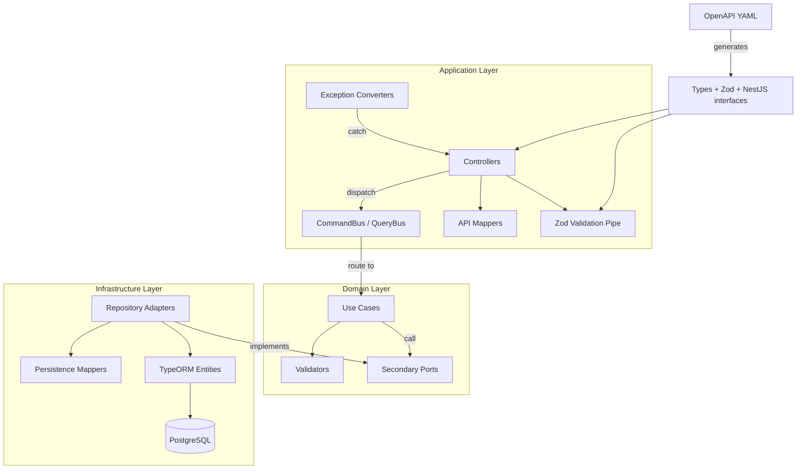
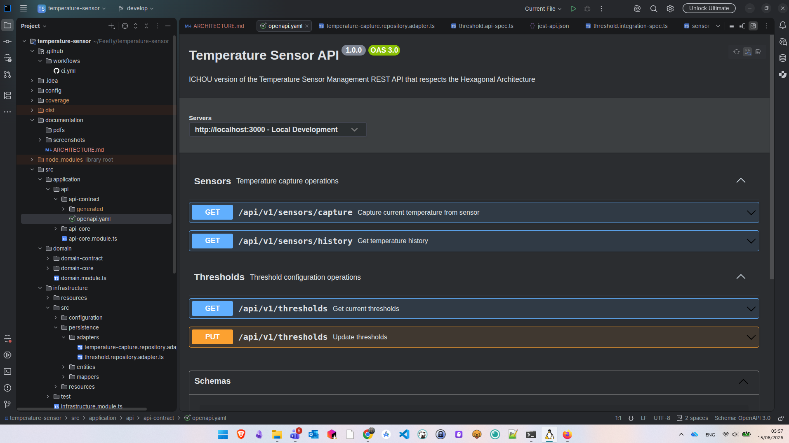
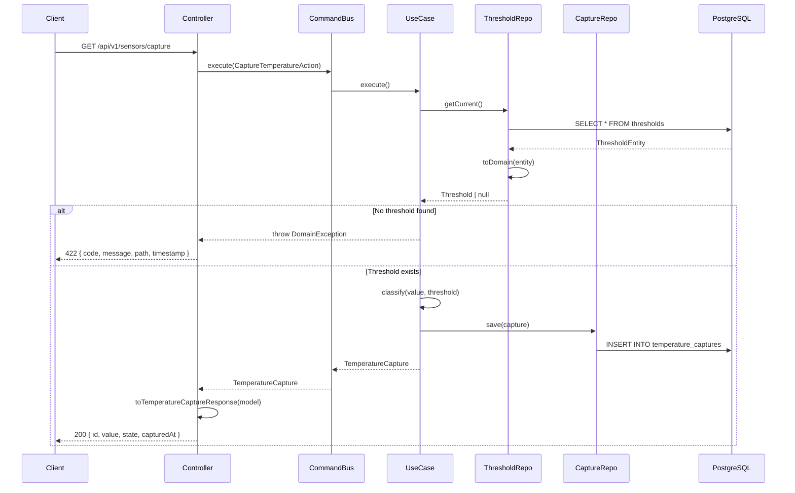
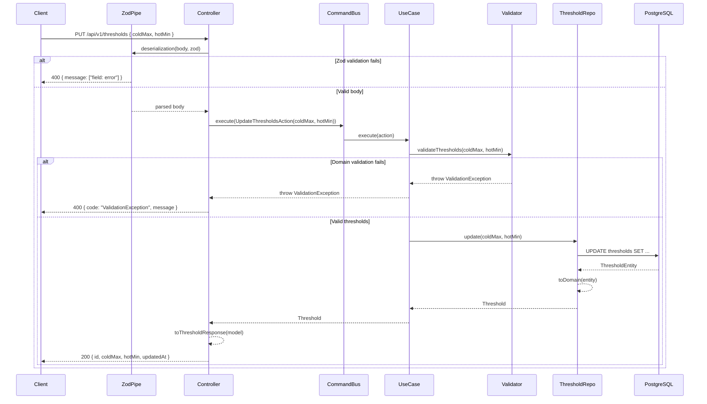
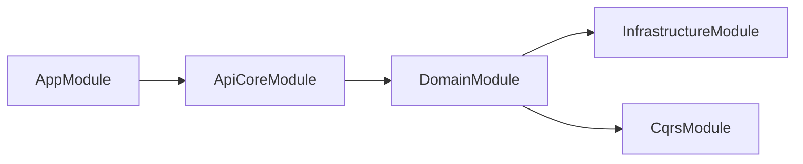
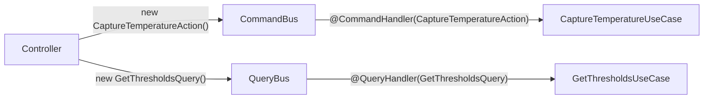
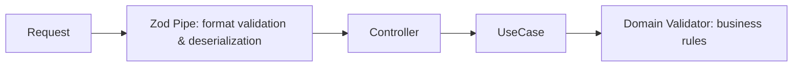
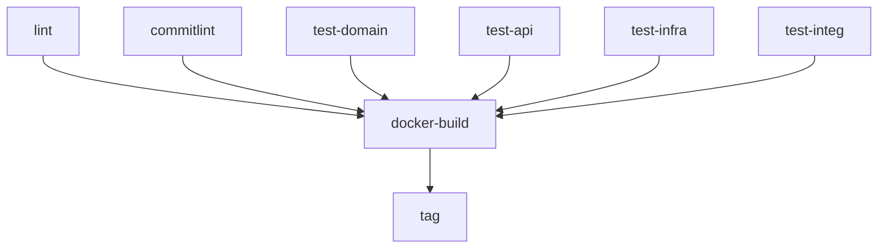
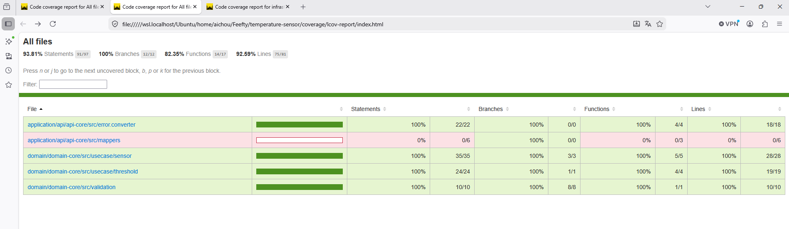

# Temperature Sensor API Architecture Documentation (Version PDF Disponible Aussi)

## Table of Contents

1. [Framework Choice](#1-framework-choice)
2. [Architecture Overview](#2-architecture-overview)
3. [Project Structure](#3-project-structure)
4. [Contract-First Approach](#4-contract-first-approach)
5. [CQRS Mediator Pattern](#5-cqrs-mediator-pattern)
6. [Hexagonal Architecture: Ports & Adapters](#6-hexagonal-architecture--ports--adapters)
7. [Validation Strategy](#7-validation-strategy)
8. [Error Handling](#8-error-handling)
9. [Testing Strategy](#9-testing-strategy)
10. [Naming Conventions](#10-naming-conventions)
11. [Commands Reference](#11-commands-reference)
12. [Docker & Deployment](#12-docker--deployment)
13. [CI/CD Pipeline](#13-cicd-pipeline)
14. [Problems Encountered & Decisions](#14-problems-encountered--decisions)
15. [Conventional Commits](#15-conventional-commits)
16. [Screenshots](#16-screenshots)

---

## Start The Application

Start the db
```shell
docker compose up -d postgres
```

Build & Start the app
```shell
npm run start
```

Coverage report inside root/converage folder
```shell
npm run test:cov	
````

---

## 1. Framework Choice

### Why NestJS over Express?

I initially considered **Express.js** for its simplicity. However, after evaluating the requirements (hexagonal architecture, CQRS, dependency injection, contract-first), i've gone with **NestJS** for the following reasons:

| Criteria             | NestJS                                                                     |
|----------------------|----------------------------------------------------------------------------|
| Dependency Injection |             Built-in, module-based              |
| CQRS / Mediator |   `@nestjs/cqrs` built-in instead of manual Engine primary/secondary ports implementation |
| Module system |          First-class modules with imports/exports      |
| TypeScript |       Native by default                              |
| Testing |             `Test.createTestingModule()` with overrides          |
| OpenAPI |               `@nestjs/swagger` (supports static YAML serving)        |

**The decisive factor**: NestJS provides a **built-in CQRS module** (`@nestjs/cqrs`) with `CommandBus`, `QueryBus`, `@CommandHandler`, `@QueryHandler`, which mean i don't need to create a Mediator pattern Engine that links the commands/queries by their domain validators/usecases from scratch as we do in Java.

> Sources:
> - [Node.js Frameworks comparison](https://encore.dev/articles/node-js-frameworks)
> - [Express vs NestJS](https://poyesis.fr/blogs/comparatif-framework-node-vs-nest-vs-express/)
> - [Command Bus Design Pattern](https://www.arnaudlanglade.com/fr/command-bus-design-pattern/)
> - [NestJS Project Structure Best Practices](https://encore.dev/articles/nestjs-project-structure-best-practices)
> - [Hexagonal Architecture in NestJS](https://medium.com/@sagarsishir51/mastering-hexagonal-architecture-in-nestjs-a-practical-guide-ccc10ed155bf)

---

## 2. Architecture Overview



---

### Swagger documentation



### Capture Temperature Endpoint Sequence Diagram



### Update Thresholds Sequence Diagram 



---

## 3. Project Structure

Each module follows a **`src/` + `test/`** convention (inspired by Java's `src/main/` + `src/test/`):

```
temperature-sensor/
├── src/
│   ├── application/
│   │   └── api/
│   │       ├── api-contract/
│   │       │   ├── openapi.yaml              ← THE source of truth
│   │       │   └── generated/                ← auto-generated (types, zod, nestjs)
│   │       ├── api-core/
│   │       │   ├── src/
│   │       │   │   ├── controllers/          ← implements generated interfaces
│   │       │   │   ├── error.converter/      ← DomainException → HTTP response
│   │       │   │   ├── interceptors/         ← logging
│   │       │   │   ├── mappers/              ← domain model → API response mappers
│   │       │   │   └── configuration/        ← Zod desrialization
│   │       │   └── test/
│   │       │       ├── api/                  ← test api error responses, mocking domain
│   │       │       ├── exception/            ← test exceptions converter response
│   │       │       └── integration/          ← full stack + testcontainers
│   │       └── api-core.module.ts
│   │
│   ├── domain/
│   │   ├── domain-contract/
│   │   │   ├── command/
│   │   │   │   ├── action/                  ← CaptureTemperatureAction, UpdateThresholdsAction
│   │   │   │   └── query/                   ← GetThresholdsQuery, GetTemperatureHistoryQuery
│   │   │   ├── exceptions/                  ← DomainException, ValidationException
│   │   │   ├── models/                      ← TemperatureCapture, Threshold, TemperatureState
│   │   │   └── ports/secondary/             ← repository interfaces ( if no built in @nestjs/cqrs →, we add primary ports )
│   │   ├── domain-core/
│   │   │   ├── src/
│   │   │   │   ├── usecase/                 ← CaptureTemperature, GetHistory, GetThresholds, UpdateThresholds
│   │   │   │   └── validation/              ← threshold business rules validator
│   │   │   └── test/
│   │   │       ├── usecase/                 ← jest.fn() mocks on ports
│   │   │       └── validation/              ← pure unit tests
│   │   └── domain.module.ts
│   │
│   ├── infrastructure/
│   │   ├── src/
│   │   │   ├── configuration/               ← app.config, database.config
│   │   │   ├── persistence/
│   │   │   │   ├── adapters/                ← implements secondary ports
│   │   │   │   ├── entities/                ← TypeORM entities
│   │   │   │   └── mappers/                 ← entity ↔ domain model mappers
│   │   │   └── resources/db/
│   │   │       ├── migrations/              ← SQL schema
│   │   │       └── seeds/                   ← default data
│   │   ├── test/
│   │   │   ├── persistence/                 ← testcontainers adapter tests
│   │   │   └── setup/                       ← test database utility
│   │   └── infrastructure.module.ts
│   │
│   ├── shared/dinjection/tokens/            ← DI injection tokens (Symbols)
│   ├── app.module.ts                        ← root module
│   └── main.ts                              ← bootstrap
│
├── config/                                  ← .env, .env.test, .env.example
├── Dockerfile                               ← multi-stage build
├── docker-compose.yml                       ← app + PostgreSQL
├── openapi-ts.config.ts                     ← hey-api generator config
├── jest.config.ts                           ← unit test config
└── .github/workflows/ci.yml                 ← GitHub Actions pipeline
```

### Module Dependency Chain



---

## 4. Contract-First Approach

### Philosophy

The OpenAPI specification (`openapi.yaml`) is the **single source of truth**. We never write DTOs, request types, or response types manually. Everything is generated.

### Generation Pipeline

```
openapi.yaml → @hey-api/openapi-ts → generated/
                                        ├── types.gen.ts    (TypeScript types + runtime enums)
                                        ├── zod.gen.ts      (Zod schemas for runtime validation)
                                        └── nestjs.gen.ts   (Controller interfaces)
```

**Configuration** (`openapi-ts.config.ts`):
```typescript
import { defineConfig } from '@hey-api/openapi-ts';

export default defineConfig({
  input: './src/application/api/api-contract/openapi.yaml',
  output: { path: './src/application/api/api-contract/generated' },
  plugins: [
    { name: '@hey-api/typescript', enums: 'javascript' },
    'zod',
    'nestjs',
  ],
});
```

### What Gets Generated

| Source (YAML) | Generated | Usage |
|---------------|-----------|-------|
| `schemas.TemperatureState` enum | `const TemperatureState` (runtime object) | Used in tests for assertion without hardcoding |
| `schemas.UpdateThresholdsRequest` | `zUpdateThresholdsRequest` (Zod schema) | Used by `ZodValidationPipe` for runtime validation |
| Tags + operationIds | `SensorsControllerMethods`, `ThresholdsControllerMethods` | Controllers `implements` these interfaces |
| Response schemas | `TemperatureCaptureResponse`, `ThresholdResponse` | Controller return types |

---

## 5. CQRS Mediator Pattern

### Why CQRS?

Separating reads (queries) from writes (commands/actions) provides:
- **Single Responsibility**: each use case handles exactly one operation
- **Decoupling**: controllers don't know which use case handles their request
- **Scalability**: queries and commands can be optimized independently

### How It Works in NestJS



### Conventions

| Component                                                                                                                  | Role                      |
|----------------------------------------------------------------------------------------------------------------------------|---------------------------|
| `Action`                                                                                                                   | Write operation payload   |
| `Query`                                                                                                                    | Read operation payload    |
| `UseCase`                                                                                                                  | Business logic executor   |
| `Validator`                                                                                                                | Business logic validation |
| `CommandBus` / `QueryBus` <br/>(in Java we use our custome `BusinessEngine` with `primary`/`secondary` `ports`/`adapters`) | Mediator/router           |


### Primary Ports, Why They Don't Exist Here

In Java, primary ports define the contract between controller and domain:
```java
Controller → PrimaryPort (interface) → MediatorBusinessEngine → UseCase/Validators → Adapters (implements PrimaryPort)
```

In NestJS with CQRS, the **bus replaces the primary port**:
```typescript
Controller → CommandBus.execute(Action) → UseCase (handler)
```

---

## 6. Hexagonal Architecture, Ports & Adapters

### Controller (Api Core)

**Application Layer** = controller that implements the endpoints interfaces generated by the openAPI:

```typescript
// src/application/api/api-core/controllers/threshold.controller.ts
@Get()
async thresholds(): Promise<ThresholdsResponse> {
  const result: Threshold = await this.queryBus.execute(new GetThresholdsQuery());
  return toThresholdResponse(result);
}
```

### UseCase (Domain Core)

**Business Logic** = the core business logic of the application, contacts the infra using secondary ports, returns results to the api controllers:

```typescript
// src/domain/domain-core/usecase/threshold/get-thresholds.usecase.ts
@QueryHandler(GetThresholdsQuery)
export class GetThresholdsUseCase implements IQueryHandler<GetThresholdsQuery, Threshold> {...}
```

### Ports (Domain Contract)

**Secondary Ports** = interfaces that the domain needs (called by use cases, implemented by infrastructure):

```typescript
// src/domain/domain-contract/ports/secondary/threshold.repository.port.ts
export interface ThresholdRepositoryPort {
  getCurrent(): Promise<Threshold | null>;
  update(coldMax: number, hotMin: number): Promise<Threshold>;
}
```

### Adapters (Infrastructure)

**Repository Adapters** = implement the ports using TypeORM:

```typescript
// src/infrastructure/src/persistence/adapters/threshold.repository.adapter.ts
@Injectable()
export class ThresholdRepositoryAdapter implements ThresholdRepositoryPort {
  constructor(@InjectRepository(ThresholdEntity) private readonly repo: Repository<ThresholdEntity>) {}

  async getCurrent(): Promise<Threshold | null> {
    const entity = await this.repo.findOne({ where: {}, order: { updatedAt: 'DESC' } });
    return toDomain(entity);
  }
}
```

### Injection Tokens

TypeScript interfaces disappear at runtime. NestJS cannot inject by interface type. We use **Symbols** as injection tokens:

Bridging compile-time interfaces with runtime implementations.

```typescript
// src/shared/dinjection/tokens/injection-tokens.ts
export const THRESHOLD_REPOSITORY = Symbol('THRESHOLD_REPOSITORY');

// Infrastructure module, registers the implementation
{ provide: THRESHOLD_REPOSITORY, useClass: ThresholdRepositoryAdapter }

// UseCase, injects via token
constructor(@Inject(THRESHOLD_REPOSITORY) private readonly repo: ThresholdRepositoryPort) {}
```

### Persistence Mappers

Mappers convert between infrastructure entities and domain models. They handle `null` (when no entity found):

```typescript
export function toDomain(entity: ThresholdEntity | null): Threshold | null {
  if (!entity) return null;
  return { 
    id: entity.id,
    coldMax: Number(entity.coldMax), 
    hotMin: Number(entity.hotMin), 
    updatedAt: entity.updatedAt
  };
}
```

---

## 7. Validation Strategy

### Two Layers of Validation


| Layer | Responsibility | Example | HTTP Status |
|-------|---------------|---------|-------------|
| **Zod (API)** | Format, types, bounds from OpenAPI | `coldMax` must be a number between -50 and 60 | 400 |
| **Domain Validator** | Business rules | `coldMax` must be less than `hotMin` | 400 (ValidationException) |

### Zod Validation (Generated from OpenAPI)

The `ZodValidationPipe` uses schemas **generated automatically** from `openapi.yaml`:

**Zero manual maintenance** → change the YAML, regenerate, validation updates automatically:

```yaml
# openapi.yaml
UpdateThresholdsRequest:
  properties:
    coldMax:
      type: number
      minimum: -50
      maximum: 60
```

Generates:
```typescript
// zod.gen.ts (auto-generated, never edited manually)
export const zUpdateThresholdsRequest = z.object({
  coldMax: z.number().gte(-50).lte(60),
  hotMin: z.number().gte(-50).lte(60),
});
```

Used in controller:
```typescript
@Put()
@UsePipes(new ZodValidationPipe(zUpdateThresholdsRequest))
async updateThresholds(@Body() body: UpdateThresholdsRequest): Promise<UpdateThresholdsResponse> { ... }
```

---

## 8. Error Handling

### Exception Converters

Following the pattern from harvest-connect (`*ExceptionConverter`), each domain exception type has a dedicated converter:

**Note**:
I used a centralized exception for all the domain exceptions just for simplicity, but in a real world case, each error should 
have a dedicated exception and exception converter to handle it, to make it easier for the client to understand the error and for us 
to find the bug and fix it.

| Exception | Converter | HTTP Status | Meaning |
|-----------|-----------|-------------|---------|
| `ValidationException` | `ValidationExceptionConverter` | 400 | Business rule violated |
| `DomainException` | `DomainExceptionConverter` | 422 | Domain cannot process |
| `Error` (unhandled) | NestJS default | 500 | Unexpected |

**Registration order matters**  → `ValidationExceptionConverter` is registered first because `ValidationException extends DomainException`. NestJS uses the **most specific** filter that matches.

### Error Response Shape

```json
{
  "statusCode": 422,
  "code": "DomainException",
  "message": "No threshold configuration found",
  "timestamp": "2026-06-14T12:00:00.000Z",
  "path": "/api/v1/sensors/capture"
}
```

---

## 9. Testing Strategy

### Architecture (inspired by Harvest-Connect backend (my current tasks in PlatformTeam))

| Test Type | Layer | What's Mocked | Database | Purpose |
|-----------|-------|---------------|----------|---------|
| **Domain Unit** | Domain | Secondary ports (`jest.fn()`) | ❌ | Test use case logic in isolation |
| **Validator Unit** | Domain | Nothing (pure function) | ❌ | Test business rules |
| **Exception Converter** | API | `ArgumentsHost` (mock) | ❌ | Test exception → HTTP mapping |
| **API Error** | API | `CommandBus`/`QueryBus` (mock) | ❌ | Test error response format |
| **Integration** | Full stack | Nothing | ✅ Testcontainers | Full flow: HTTP → DB |
| **Infrastructure** | Infra | Nothing | ✅ Testcontainers | Test adapter correctness |

### Test Naming Convention

Following harvest-connect pattern:
```
methodUnderTest_should_rxpectedBehavior_when_condition
```

Examples:
```typescript
'getTemperatureHistory_should_return200WithArray_when_capturesExist'
```

### Regions

Tests are organized with `//region` comments for collapsibility:
```typescript
//region Success scenarios
it('execute_shouldReturnCapture_whenThresholdExists', ...);
//endregion

//region Error scenarios
it('execute_shouldThrowDomainException_whenNoThresholdFound', ...);
//endregion
```

### Domain Tests Mocks

Following Java's use of `@InjectMock` (Mockito), we use `jest.fn()`:

```typescript
let thresholdRepository: jest.Mocked<ThresholdRepositoryPort>;

beforeEach(() => {
  thresholdRepository = { getCurrent: jest.fn(), update: jest.fn() };
  usecase = new GetThresholdsUseCase(thresholdRepository);
});

it('execute_shouldThrowDomainException_whenNoThresholdFound', async () => {
  thresholdRepository.getCurrent.mockResolvedValue(null);
  await expect(usecase.execute()).rejects.toThrow(DomainException);
});
```

### Integration Tests with Real Database (Testcontainers)

Integration tests boot the **full NestJS application** with a real PostgreSQL container:

```typescript
beforeAll(async () => {
  container = await new GenericContainer('postgres:16-alpine')
    .withExposedPorts(5432)
    .withWaitStrategy(Wait.forLogMessage('database system is ready to accept connections', 2))
    .start();
  // ... wire real TypeORM + real adapters
});
```

No stubs, no mocks, the full flow from HTTP request to database and back.

---

## 10. Naming Conventions

> Source: [NestJS File and Folder Naming](https://mahabub-r.medium.com/mastering-file-and-folder-naming-conventions-in-nestjs-for-a-scalable-backend-0edb1115033d)

| Element | Convention | Example                               |
|---------|-----------|---------------------------------------|
| Files | `kebab-case.type.ts` | `capture-temperature.usecase.ts`      |
| Classes | `PascalCase` | `CaptureTemperatureUseCase`           |
| Interfaces | `PascalCase` + `Port` suffix | `ThresholdRepositoryPort`             |
| Actions | `PascalCase` + `Action` suffix | `CaptureTemperatureAction`            |
| Queries | `PascalCase` + `Query` suffix | `GetThresholdsQuery`                  |
| Mappers | pure functions, `camelCase` | `toThresholdResponse()`, `toDomain()` |
| Test files | `*.spec.ts` / `*.integration-spec.ts` / `*.api-spec.ts` | `domain-excetion.converter.spec.ts`     |


---

## 11. Conventional Commits

> Source: [Conventional Commits v1.0.0](https://www.conventionalcommits.org/en/v1.0.0/)

Format:
```
<type>(scope): JIRA-KEY - description
---
Types [ feat, fix, test, ci, docs, chore, refactor]
```

---

## 11. Commands Reference

### Build & Run

Clean + generate OpenAPI types + compile TypeScript
```shell
npm run build
```
Build then run (`node dist/main`)
```shell
npm run start
```
Watch mode (hot reload)
```shell
npm run start:dev
```
Generate types/zod/nestjs from OpenAPI YAML
```shell
npm run generate
```
Remove `dist/` and `generated/`
```shell
npm run clean
```
Run linter pour checker
```shell
npm run lint 
```
Fix code format with linter
```shell
npm run format 
```

### Test

Unit + API tests
```shell
npm run test:all	
```
API tests (error + integration + exception)
```shell
npm run test:api	
```
Domain unit tests only
```shell
npm run test:domain
```
Domain + exception converters tests
```shell
npm test
```
Integration tests only (needs Docker)
```shell
npm run test:integration	
```
Infrastructure adapter tests (needs Docker)
```shell
npm run test:infra
```
Unit tests with coverage report inside root/converage folder
```shell
npm run test:cov	
```

### Docker

Start PostgreSQL only
```shell
docker compose up -d postgres
```
Start app + PostgreSQL
```shell
docker compose up
```
Stop all + remove volumes (reset DB)
```shell
docker compose down -v
```

---

## 12. Docker & Deployment

### Dockerfile (Multi-stage)

```dockerfile
FROM node:20-alpine AS builder
WORKDIR /app
# --> Builder : install deps + generate + compile

FROM node:20-alpine AS production
WORKDIR /app
COPY --from=builder /app/dist ./dist
COPY --from=builder /app/node_modules ./node_modules
COPY --from=builder /app/package.json ./
COPY --from=builder /app/src/application/api/api-contract/openapi.yaml ./src/application/api/api-contract/openapi.yaml
# --> Production : minimal image
```

**Key decisions:**
- `dumb-init` for proper signal handling (PID 1 problem)
- `USER node` for security (non-root)
- OpenAPI YAML copied for runtime Swagger UI serving

### Docker Compose

PostgreSQL init scripts are mounted as individual files (not subdirectories) because `docker-entrypoint-initdb.d/` only executes files at its root level:

```yaml
volumes:
  - ./src/infrastructure/src/resources/db/migrations/001_initial_schema.sql:/docker-entrypoint-initdb.d/01_schema.sql
  - ./src/infrastructure/src/resources/db/seeds/001_default_thresholds.sql:/docker-entrypoint-initdb.d/02_seeds.sql
```

---

## 13. CI/CD Pipeline

GitHub Actions workflow (`.github/workflows/ci.yml`):


---

## Appendix: Environment Configuration

> Source: [NestJS Environment Variables](https://bhargavacharyb.medium.com/setting-up-environment-variables-and-configurations-in-nestjs-a6372fb81f31)

Configuration files in `config/`:
- `.env` :  development
- `.env.test` :  test
- `.env.example` :  template (committed)

Loaded via `ConfigModule.forRoot({ envFilePath: 'config/.env' })`.

---

## 14. Problems Encountered & Decisions

### Problem 1: Runtime Enums from OpenAPI

**Issue**: `@hey-api/typescript` generates **type unions** (`'HOT' | 'COLD' | 'WARM'`), not runtime values. Tests couldn't use `Object.values(TemperatureState)` for assertions.

**Solution**: Added `enums: 'javascript'` to the plugin config. Now generates:
```typescript
export const TemperatureState = { HOT: 'HOT', COLD: 'COLD', WARM: 'WARM' } as const;
export type TemperatureState = typeof TemperatureState[keyof typeof TemperatureState];
```

Both a runtime object AND a TypeScript type.

### Problem 2: Validation Without Manual DTO Classes

**Issue**: NestJS `ValidationPipe` requires classes with `class-validator` decorators. This duplicates constraints already defined in OpenAPI.

**Solution**: Replaced `class-validator` with **Zod** (generated from OpenAPI via hey-api `zod` plugin) + a custom `ZodValidationPipe`. Zero manual maintenance, YAML is the single source.

### Problem 3: Controller Interface Naming

**Issue**: The `nestjs` plugin generates `SensorsControllerMethods`  ,  we wanted `SensorsControllerApi`.

**Decision**: Kept the default ,  it's hardcoded in the plugin and not configurable. Accepted as-is.

### Problem 4: PostgreSQL docker-entrypoint-initdb.d Subdirectories

**Issue**: PostgreSQL init only executes `.sql` files **directly** in `docker-entrypoint-initdb.d/`, not in subdirectories.

**Solution**: Mount individual SQL files (not directories) with ordered prefixes (`01_schema.sql`, `02_seeds.sql`).

### Problem 5: Testcontainers Wait Strategy

**Issue**: `Wait.forHealthCheck()` was unreliable ,  tests got `ECONNRESET` because PostgreSQL wasn't ready.

**Solution**: `Wait.forLogMessage('database system is ready to accept connections', 2)` ,  waits for PostgreSQL to print this message twice (once on initial start, once after recovery).

### Problem 6: TypeScript Interfaces Disappear at Runtime

**Issue**: Can't use `@Inject(ThresholdRepositoryPort)` because interfaces don't exist at runtime in JavaScript.

**Solution**: Use `Symbol` injection tokens as the bridge between compile-time interfaces and runtime DI.

### Problem 7: PostgreSQL Decimal Columns Return Strings

**Issue**: `decimal(5,2)` columns are returned as strings (`'25.50'` not `25.5`) by the `pg` driver.

**Solution**: Persistence mappers cast with `Number()`: `coldMax: Number(entity.coldMax)`.

### Problem 8: Stubs vs Mocks in Domain Tests

**Issue**: Initially used in-memory stubs (mini-repositories with sorting logic). This violated the stub principle ,  stubs shouldn't contain logic.

**Decision**: Replaced all stubs with `jest.fn()` mocks for domain tests (like harvest-connect uses `@InjectMock` + Mockito). Stubs removed.

### Problem 9: Integration Tests Without Real DB

**Issue**: Initial "integration" tests used in-memory stubs ,  not true integration tests.

**Decision**: Rewrote integration tests with testcontainers (real PostgreSQL). Full stack: HTTP → Controller → UseCase → Adapter → Database.

---

## 16. Screenshots

### Coverage Report

`npm run test:cov`


---

`coverage/lcov-report/index.html` browser



### Application Running


---

Testing with `Bruno` in local:

`PUT threshold`


---

`GET sensor capture`


---

`GET thresholds`


---

`GET sensor history`


---

*Project created for Feefty from Harvest Groupe*